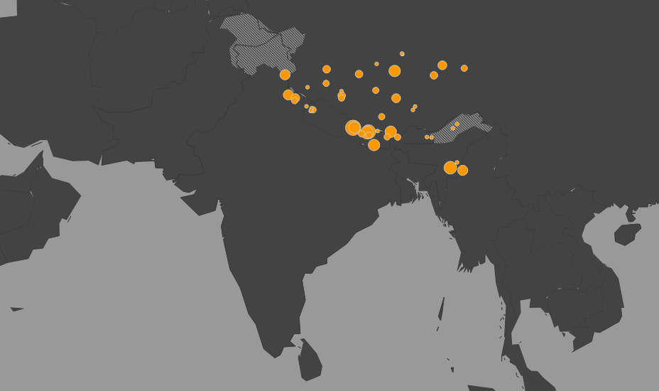

### Earthquake Forcasting

#### Introduction
In the current analysis, we have attempted to fit earthquake inter-event time data corresponding
to the Himalayas and the adjacent regions, to various probability distributions. We have 
evaluated these models using two popular non-parametric tests. The gamma distribution was
found to be the best fit among the applied models, with the shape parameter equal 0.8906 and a
scale parameter equal to 635.324.

#### Results
After completion of our analysis, the following significant results were noted:
- The AIC test established the exponential distribution (β = 565.93) as the best fit model for
our data. The gamma distribution (α = 0.8906, θ = 635.324) comes a close second with an AIC value
exceeding that of the former by a mere 1.3 units.
- The KS test established the gamma distribution (α = 0.8906, θ = 635.324) as the best fit model
for our data, while the Weibull distribution (k = 0.9328, λ = 548.354) comes a close second, its value
of the KS test statistic exceeding that of the former by a mere 0.013 units.
- All of the distributions, except the lognormal model estimated using the method of moments,
have passed the KS goodness of fit test. The lognormal distribution is generally not the best alternative
for this purpose; the results of our analysis have proven this.
- The models estimated using Maximum Likelihood Estimation have, in general, turned out to
perform better than those estimated using Method of Moments.

While the Gamma and the Weibull distributions stand out as the best fitting models when evaluated
using the KS test, they lose out to the exponential distribution (which is, essentially, a special case
of the Gamma distribution), by a few points. Since the AIC test penalizes a model for an increase in
its number of parameters, it assigns a slightly better score to the exponential distribution, due to the
presence of just one parameter as opposed to two.

#### The Team
Ankit Sonthalia   
Aniruddha Jayant Karajgi    
Jatin Singh  
Meet Kanani   
Nayan Khanna   
Rahul Jha    
Rohit K Bharadwaj    
Subham Kumar Dash   

The final report can be found [here](./Earthquake_Forecasting.pdf).
